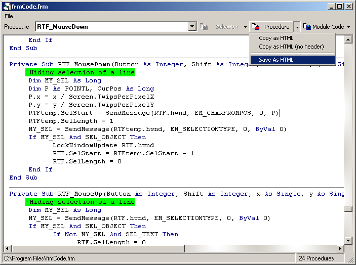



## Bobo VB Code To HTML

### Description

The Richtextbox is a great tool for displaying text but it can be quite a task converting it's format for use on the web. This project is part of a Code Library application that I still use today. It has HTML saving options for publishing source code to web sites. It demonstrates manipulation of the Richtextbox control, string parsing routines and syntax highlighting. It will also format your code applying standard indentation, remove blank lines and truncate long lines neatly, making your code much more readable. You can then choose to save it back to disk as a VB file(retaining it's original header), an HTML file or as a rich text file(rtf). Like all code this old, I would do many of the functions quite differently nowadays, but there are still some handy techniques used here. I hope I didn't create too many bugs when I pulled it out of my Code Library app ! I have had quite a few emails of late enquiring as to when I'll upload some more submissions, so in response to those here is yet another Bobo submission !
 
### More Info
 

             |
---                |---
**Submitted On**   |2005-01-16 23:42:48
**By**             |[MrBobo](https://github.com/Planet-Source-Code/PSCIndex/blob/master/ByAuthor/mrbobo.md)
**Level**          |Advanced
**User Rating**    |4.8 (24 globes from 5 users)
**Compatibility**  |VB 6\.0
**Category**       |[String Manipulation](https://github.com/Planet-Source-Code/PSCIndex/blob/master/ByCategory/string-manipulation__1-5.md)
**World**          |[Visual Basic](https://github.com/Planet-Source-Code/PSCIndex/blob/master/ByWorld/visual-basic.md)
**Archive File**   |[Bobo\_VB\_Co1840781172005\.zip](https://github.com/Planet-Source-Code/mrbobo-bobo-vb-code-to-html__1-58308/archive/master.zip)

